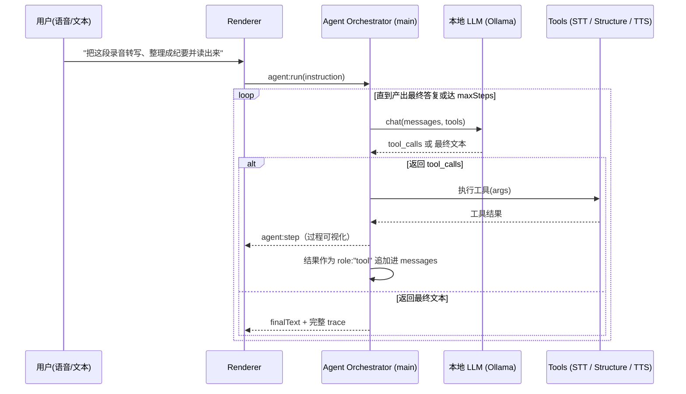

# SpeakSpace 智能体化设计（Agent Design）

> 目标：把现在"按钮驱动的固定流水线"升级成"本地小模型自己编排本地工具"的**有边界智能体**，
> 在不新增功能、最大化复用存量代码的前提下，让应用在定义上真正成为 agent。

---

## 1. 现状与差距

当前形态是 **workflow（固定流程）**：用户点按钮 → STT → LLM 整理 → TTS，控制流写死在代码里，
`llm-service.js` 调 Ollama `/api/chat` 时**没有传 `tools`**，LLM 只是流水线里的一个零件。

| | Workflow（现状） | Agent（目标） |
|---|---|---|
| 谁决定下一步 | 代码 / 用户按钮 | **模型自己决定** |
| 工具调用 | 无（直接函数调用） | 模型发起 `tool_calls` |
| 形态 | 流水线 | 想 → 调用 → 观察 → 再想 的**循环** |

> 关键点：**"模型决定控制流 + 在循环里调用工具"** 才是 agent 的定义性特征；
> 单纯把思考过程（CoT）显示出来不算 agent。

---

## 2. 设计原则

1. **复用而非重写**：把已有能力包成工具（tool），不写新功能。
2. **有边界**：工具数量少（先 3 个）、循环深度封顶（`maxSteps`）、失败可降级。
3. **可观测**：每一步的"计划 / 调了哪个工具 / 工具结果"都推给前端，形成可视化推理链路。
4. **可测试**：沿用项目的依赖注入风格（`createX({deps})`），核心循环不依赖真实模型即可测。

---

## 3. 工具清单（Tool Registry）

每个工具映射到一段**已有**能力：

| 工具名 | 作用 | 复用 | 参数 |
|---|---|---|---|
| `transcribe_audio` | 本地语音转写 | `transcription-service.transcribeAudio` | `file_path` |
| `structure_note` | 文本→结构化纪要(标题/摘要/要点/行动项/标签) | `structured-processor.generateStructuredNote` | `text` |
| `speak` | 本地 TTS 朗读 | `tts-service.synthesizeTextInNodeProcess` | `text`, `speaker_id?` |

> 后续可平滑扩展：`search_notes` / `save_note` / `ask_note` / `translate`（都已有对应 service）。

工具会被转成 Ollama 的 function schema：

```json
{ "type": "function",
  "function": { "name": "...", "description": "...", "parameters": { /* JSON Schema */ } } }
```

---

## 4. 编排循环（Orchestration Loop）



循环要点：
- **退出条件**：模型返回**不带** `tool_calls` 的普通文本 = 最终答复。
- **兜底解析**：小模型可能不走原生 `tool_calls`，而是把 `{"tool":...,"args":...}` 写进 `content`；
  编排器对这种情况也做解析（`extractToolDirective`），显著提高小模型可用率。
- **防打转**：`maxSteps`（默认 6）到顶即结束并返回 `completed:false`。
- **可取消**：透传 `AbortSignal`。

---

## 5. 代码落点（本次最小切片）

| 文件 | 改动 |
|---|---|
| `src/main/llm-service.js` | 新增 `createLocalChat` / `generateLocalChat`：支持 `tools`，返回**完整 message**（含 `tool_calls`），空 content 不报错 |
| `src/main/agent-orchestrator.js` | **新增**：工具注册表 + 编排循环 + 兜底解析 |
| `src/main/main.js` | 新增 IPC `agent:run`，并把 `agent:step` 过程事件转发给渲染层 |
| `src/preload/preload.js` | 暴露 `runAgent(instruction, options)` 与 `onAgentStep(listener)` |
| `tests/agent-orchestrator.test.js` | 用 mock 的 `chat` + mock 工具，验证循环顺序、上下文回填、maxSteps、兜底解析、未知工具恢复 |

调用入口（渲染层 / DevTools 即可验证）：

```js
const result = await window.desktopSTT.runAgent(
  "把 D:/rec.wav 转写、整理成纪要，再读给我听"
);
// result.finalText / result.steps（完整 trace）
```

返回结构：

```text
{ finalText, steps[], modelName, stepCount, completed }
steps[i] = { type: "tool_call" | "tool_result" | "final", tool, args, ok, result, data, error }
```

UI 渲染：监听 `onAgentStep`，把每个 `step` 渲染成一张"思考/动作"卡片；
`step.tool === "speak"` 且 `step.data.audio` 时用现有 Web Audio 播放（与当前 TTS 播放复用同一套）。

---

## 6. 风险与评估价值（写进论文）

- **主要风险**：`qwen3:4b` 是小模型，多步工具调用 / 稳定输出 tool-call 是它最易翻车处
  （选错工具、参数乱、死循环）。已用"少工具 + 步数封顶 + 兜底解析 + 失败降级"控制。
- **评估抓手**：把"**4B 级本地模型能否撑起 agentic 编排**"作为一章评估，
  指标可含：工具选择准确率、单链成功率、平均步数、端到端时延；
  并横向对比 `qwen2.5`（function calling 更稳）vs `qwen3`、以及不同设备。
  这比单测时延/内存更上一层，是本项目的研究贡献点。

---

## 7. 后续可扩展

1. 把 `search_notes / save_note / ask_note / translate` 加入工具表 → 覆盖更多自然语言指令。
2. `agent:step` 增加"模型思考摘要"展示（CoT 可视化，锦上添花）。
3. 给工具加权限/确认（如写入笔记前确认），贴近真实 agent 的安全实践。
